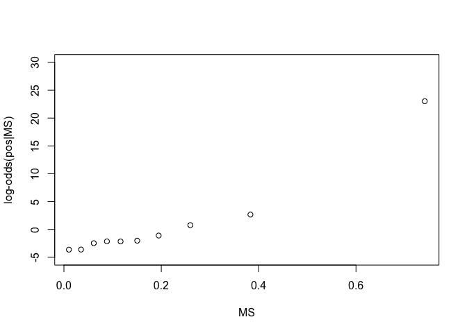
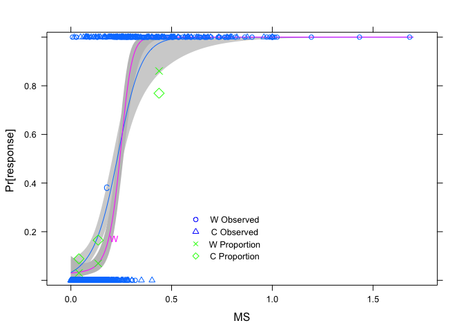
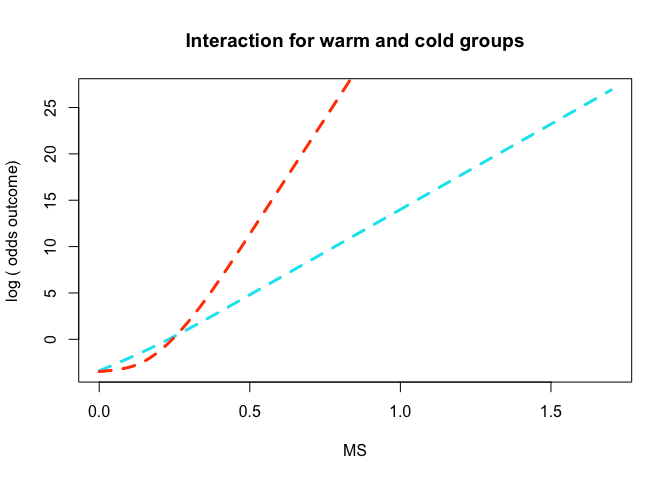
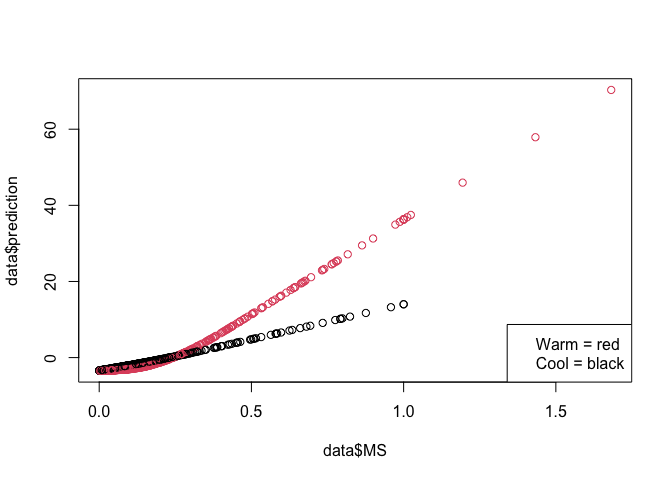
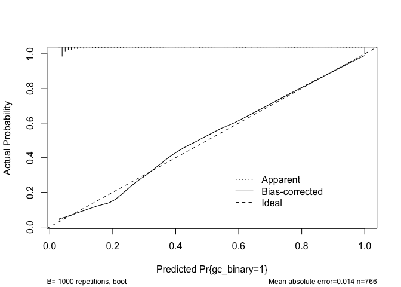
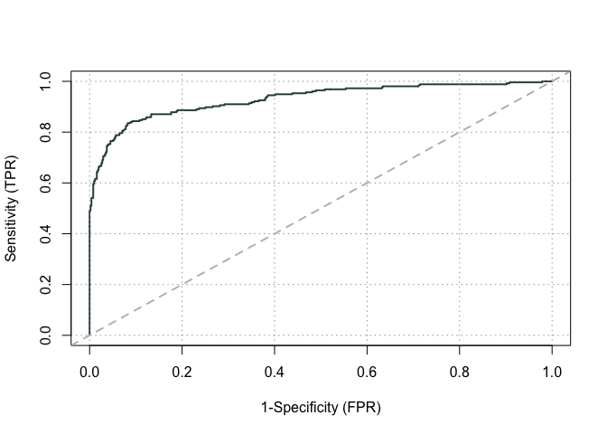
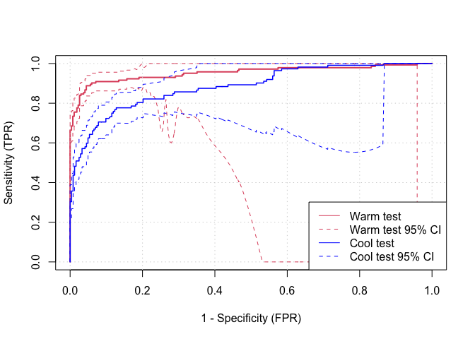

Spline transformations
================
Helena
29/06/2021

## Intro to part 3

I previously used lrm to fit a model without any transformations of the
underlying data. Now I have used the rcs function to add a
transformation - how do I tell if this is better? Differences are from
the model onwards.

## Calculating and classifying full test results

Vicki has provided us with the following dataset, with peak slow-phase
velocity (SPV, degrees/s) measurements for the full caloric test for 800
patients. (Order = whether warm or cold was performed first, WR = warm
right, WL = warm left, CR = cold right, CL = cold left)

``` r
library (tidyverse) #Load the tidyverse

data <- read_csv("caloric_tidy.csv")
```

From these SPV values, values for Canal Paresis (CP) and Directional
Preponderance (DP) were calculated as follows:

``` r
data <- mutate(data, 
       CP = ((WR + CR)-(WL + CL))/(WR + WL + CR + CL),
       DP = ((WR + CL) - (WL + CR))/(WR + WL + CR + CL))
```

A patient has a significant finding (pos) if their CP or DP score is
\>20 or \< -20, or all 4 measurements (WR, WL, CR, CL) are \< 8. A high
CP or DP score indicates an imbalance between the ears. Low values for
all measurements indicates both ears are hypofunctional. The column
gold\_call indicates whether there is any significant finding.

``` r
data <- mutate(data, 
                CP_call = if_else(((CP > -0.20) & (CP < 0.20)), "Neg", "Pos"),
                DP_call = if_else(((DP > -0.20) & (DP < 0.20)), "Neg", "Pos"),
                Hypo_call  = if_else(((WR < 8) & (WL < 8) & (CR < 8) & (CL <8)), "Hypo", "Normal"),
                gold_call = if_else(((CP_call == "Pos") | (DP_call == "Pos") | (Hypo_call == "Hypo")), 
                                    "Pos", "Neg"))
```

## Using the monothermal test as a screen

The monothermal screening test works as follows: The full test is
performed either warms first or cools first. After performing the first
temperature, a monothermal test score can be calculated, and if this
score is within an acceptable range the patient will not have to undergo
the full test. The purpose of the following analysis is to determine
whether monothermal screen results are a good predictor of full test
outcome, whether the temperature of the monothermal screen affects the
prediction and determining the best cutoff for the monothermal screen.

The code below calculates a monothermal result depending on the order
the tests were conducted. Then checks if the monothermal measurements
indicate bilateral hypofunction and converts these test scores to NA (as
these findings will be significant irrespective of score).

``` r
#Calculates monothermal screen score depending on order
data <- mutate(data,
               MS = if_else(Order == "W", (WR - WL)/(WR + WL), (CR - CL)/(CR + CL)))

#Convert to non-negative number
data <- mutate(data,
               MS = if_else(MS <0, MS*-1, MS))

#Identifies patients where the monothermal screen has indicated bilateral hypofunction
data <- mutate(data,
                HS = if_else(((Order == "W") & (WR < 8) & (WL <8)), "Hypo",
                        if_else(((Order =="C") & (CR < 8) & (CL <8)), "Hypo", "Normal")))

#If HS == "Hypo" MS needs to be converted to NA (finding will be significant irrespective of score)
data <- mutate(data,
               MS = ifelse((HS == "Hypo"), NA, MS))
```

## Logistic regression model

Logistic regression can be used to model the relationship between MS
(monothermal screen score), Order (cold or warm monothermal test) and
gold\_call (full caloric test outcome).

### Data preparation

First I have prepared the data by converting categorical variables to
factors and removing the rows with NA values (these are the patients who
will be classed as significant whatever their screen score, as their
measurements indicate bilateral hypofunction - see above).

``` r
#Convert gold_call and Order to factors
data$gold_call <- as.factor(data$gold_call)
data$Order <- as.factor(data$Order)

#Remove rows with NAs from data - (34 rows)
data <- data[!(is.na(data$MS)),]
```

### Model assumptions

Next I can check that the data are not imbalanced between warm and cold
tests (there are patients in each of the 4 cells of the xtable).

``` r
xtabs(~ gold_call + Order, data = data)
```

    ##          Order
    ## gold_call   C   W
    ##       Neg 243 268
    ##       Pos 112 143

Next I checked whether there is a linear relationship between MS and
log(odds gold\_call = positive). To do this, I split the data into 10
bins based on 10 quantiles. I calculated the proportion of patients that
were positive in each bin, then converted this to the log(odds) of being
positive in each bin. I calculated the mean MS in each bin (mean is
better than median here as if the data is skewed, we want to see it) and
plotted MS (x-axis) vs log(odds) of being positive (y axis). This should
be approximately linear. It looks like it deviates from linearity by
some amount, so may require some transformation to correct for this. It
looks like this deviation could be captured by adding a single knot (two
different gradients).

``` r
#Split MS into quartiles
q <- quantile(data$MS, probs=seq(0,1,0.1))

#Find numbers of pos and neg in each quartile, calculate proportion (probability) positive
table1 <- table(data$gold_call[data$MS< q[2]])
p1 <- table1[[2]]/(table1[[1]]+table1[[2]])

table2 <- table(data$gold_call[data$MS >=q[2] & data$MS < q[3]])
p2 <- table2[[2]]/(table2[[1]]+table2[[2]])

table3 <- table(data$gold_call[data$MS >= q[3] & data$MS < q[4]])
p3 <- table3[[2]]/(table3[[1]]+table3[[2]])

table4 <- table(data$gold_call[data$MS >= q[4] & data$MS < q[5] ])
p4 <- table4[[2]]/(table4[[1]]+table4[[2]])

table5 <- table(data$gold_call[data$MS >=q[5] & data$MS < q[6]])
p5 <- table5[[2]]/(table5[[1]]+table5[[2]])

table6 <- table(data$gold_call[data$MS >= q[6] & data$MS < q[7]])
p6 <- table6[[2]]/(table6[[1]]+table6[[2]])

table7 <- table(data$gold_call[data$MS >= q[7] & data$MS < q[8]])
p7 <- table7[[2]]/(table7[[1]]+table7[[2]])

table8 <- table(data$gold_call[data$MS >= q[8] & data$MS < q[9]])
p8 <- table8[[2]]/(table8[[1]]+table8[[2]])

table9 <- table(data$gold_call[data$MS >= q[9] & data$MS < q[10]])
p9 <- table9[[2]]/(table9[[1]]+table9[[2]])

table10 <- table(data$gold_call[data$MS >= q[10] ])
p10 <- table10[[2]]/(table10[[1]]+table10[[2]])

#Store all of these in 1 object called probs - note p10 is 1, so is replaced by an arb value close to 1
probs <- c(p1, p2, p3, p4, p5, p6, p7, p8, p9, 0.9999999999)
#Turn the probabilities into log odds
logits <- log(probs/(1-probs))

#Caluclate mean MS in each group

means <- c( mean(data$MS[ data$MS < q[2] ]),
           mean(data$MS[ data$MS >=q[2] & data$MS < q[3] ]),
           mean(data$MS[ data$MS >=q[3] & data$MS < q[4] ]),
           mean(data$MS[ data$MS >= q[4] & data$MS < q[5] ]),
           mean(data$MS[ data$MS >= q[5] & data$MS < q[6] ]),
           mean(data$MS[ data$MS >= q[6] & data$MS < q[7] ]),
           mean(data$MS[ data$MS >= q[7] & data$MS < q[8] ]),
           mean(data$MS[ data$MS >= q[8] & data$MS < q[9] ]),
           mean(data$MS[ data$MS >= q[9] & data$MS < q[10] ]),
           mean(data$MS[ data$MS >= q[10]  ]))

#Plot it
plot(means, logits, xlab = "MS", ylab = "log-odds(pos|MS)", ylim = c(-5, 30))
```

<!-- -->

It is pretty obvious from this plot that there is a strong relationship
between log(odds outcome) and MS, however this can also be tested using
the spearman2() function. This returns the rho2 statistic which gives a
value between 0 and 1, the higher the value, the stronger the
relationship. This is analogous to the Pearson correlation coefficient,
but it can also test non linear and odd shaped relationships (like a
parabola for example). The rho2 for MS is high, indicating a strong
relationship (over \~0.15 is considered relatively high). A strong
relationship allows more degrees of freedom to be spent fitting the
model (i.e more splines, which means more coefficients).

``` r
# Test the strength of the relationship between log-odds(pos|MS) and MS
library(rms)
spearman2(gold_call ~ MS + Order, data = data, p = 2)
```

    ## 
    ## Spearman rho^2    Response variable:gold_call
    ## 
    ##        rho2      F df1 df2      P Adjusted rho2   n
    ## MS    0.577 519.49   2 763 0.0000         0.575 766
    ## Order 0.001   0.90   1 764 0.3427         0.000 766

Another general rule of numbers of coefficients look at the number of
results in each class (Neg 511, Pos 255) and you need an order of
magnitude different between number in the smallest class and maximum
number of coefficients you can have.

### Model

``` r
## Prep my data so it looks like Harrell's example (p226), switch gold_call to numerical type.
data <- mutate(data,
               gc_binary = if_else(gold_call == 'Pos', 1, 0))
rms_data <- select(data, Order, MS, gc_binary)

# Define the data and use the datadist function
d <- rms_data
dd <- datadist(d); 
options(datadist= 'dd')
dd
```

    ##                 Order          MS gc_binary
    ## Low:effect       <NA> 0.060910390         0
    ## Adjust to           W 0.133034721         0
    ## High:effect      <NA> 0.258001512         1
    ## Low:prediction      C 0.003294651         0
    ## High:prediction     W 1.000000000         1
    ## Low                 C 0.000000000         0
    ## High                W 1.681818182         1
    ## 
    ## Values:
    ## 
    ## Order : C W 
    ## gc_binary : 0 1

The first step defines the data distribution. I don’t understand all the
output of this function. It has a column for each of the vectors in my
dataset. Starting from the bottom, Values shows the possible values for
my categorical variables. ‘High’ is the highest value in each vector.
‘Low’ is the lowest value. I don’t understand any other of the rows.

Next we run the model:

``` r
f <- lrm(gc_binary ~ rcs(MS, 3) * Order, data=d) #Now with splines - is this 4 knots?!!
fasr <- f # Save for later - I don't know why!
f
```

    ## Logistic Regression Model
    ##  
    ##  lrm(formula = gc_binary ~ rcs(MS, 3) * Order, data = d)
    ##  
    ##                         Model Likelihood    Discrimination    Rank Discrim.    
    ##                               Ratio Test           Indexes          Indexes    
    ##  Obs           766    LR chi2     536.91    R2       0.700    C       0.929    
    ##   0            511    d.f.             5    g        5.898    Dxy     0.859    
    ##   1            255    Pr(> chi2) <0.0001    gr     364.227    gamma   0.859    
    ##  max |deriv| 9e-12                          gp       0.381    tau-a   0.382    
    ##                                             Brier    0.085                     
    ##  
    ##                Coef     S.E.    Wald Z Pr(>|Z|)
    ##  Intercept      -3.4018  0.5271 -6.45  <0.0001 
    ##  MS             13.7881  4.6509  2.96  0.0030  
    ##  MS'             6.5706 14.8427  0.44  0.6580  
    ##  Order=W        -0.0832  0.8439 -0.10  0.9215  
    ##  MS * Order=W  -10.4244  7.9473 -1.31  0.1896  
    ##  MS' * Order=W  59.5364 28.2869  2.10  0.0353  
    ## 

``` r
anova(f)
```

    ##                 Wald Statistics          Response: gc_binary 
    ## 
    ##  Factor                                    Chi-Square d.f. P     
    ##  MS  (Factor+Higher Order Factors)         147.69     4    <.0001
    ##   All Interactions                           7.10     2    0.0287
    ##   Nonlinear (Factor+Higher Order Factors)    7.73     2    0.0209
    ##  Order  (Factor+Higher Order Factors)       10.61     3    0.0140
    ##   All Interactions                           7.10     2    0.0287
    ##  MS * Order  (Factor+Higher Order Factors)   7.10     2    0.0287
    ##   Nonlinear                                  4.43     1    0.0353
    ##   Nonlinear Interaction : f(A,B) vs. AB      4.43     1    0.0353
    ##  TOTAL NONLINEAR                             7.73     2    0.0209
    ##  TOTAL NONLINEAR + INTERACTION               9.59     3    0.0224
    ##  TOTAL                                     150.09     5    <.0001

``` r
AIC(f)
```

    ## [1] 449.7683

This produces a model with a load of new coefficients - for each
different line gradient. The p values for the coefficients don’t then
mean very much anymore. ANOVA will give p values relevant to the whole
model. This shows a very low p value for the model overall.

‘C’, which is AUC (discrimination ability) has improved though over the
previous model\! And the Akaike Information Criteria (AIC) is lower than
the model without the transformation.

Next I can plot the model:

``` r
qs <- quantile(rms_data$MS, probs=seq(0,1,(1/3)))
w <- function(...)
   with(d, {
      wa <- Order=='W'
      co <- Order=='C'
      lpoints(MS[wa], gc_binary[wa], pch=1) 
      lpoints(MS[co], gc_binary[co], pch=2)
      af <- cut2(MS, c(qs[2],qs[3]), levels.mean=TRUE) 
      prop <- tapply(gc_binary, list(af, Order), mean, na.rm=TRUE)
      agem <- as.numeric(row.names(prop))
      lpoints(agem, prop[,'W'], pch=4, cex=1.3, col='green')
      lpoints(agem, prop[,'C'],
              pch=5, cex=1.3, col='green')
      x <-rep(0.62, 4); y <- seq(.25, .1, length=4) 
      lpoints(x, y, pch=c(1, 2, 4, 5),
              col=rep(c('blue','green'),each=2)) # This relates to the legend
      ltext(x+0.2, y,
            c('W Observed ','C Observed ', 
              'W Proportion ','C Proportion '), cex=0.8) #This relates to the legend - why doesn't it work??
   } ) # Figure 10.3
plot(Predict(f, MS=seq(0, 1.7, length=200), Order, fun=plogis), ylab= 'Pr[response] ', 
     ylim=c(-.02, 1.02), addpanel=w)
```

<!-- -->

Whta is going on with the confidence intervals?? Is this because there
are few points at high MS values??

The blue points are the observed data, the S-curves are the logistic
function for each temperature and the green points are the observed
proportions for MS values (\<0.085, 0.0.85-0.2 and \>0.2), plotted at
the mean MS for each of these groups. The groups are based on the
tertiles of the data, I don’t know whether Harrell’s groupings were
based on this or are arbitrary. The observed proportion for the highest
third of values does not fall with the grey (95% ‘pointwise’ confidence
intervals), is this a clue to the non-linearity of MS/ log-odds?

The interaction between Order and MS can be seen more clearly on a log
odds scale. The following two plots show the model on a log odds scale
and predicted probabilities for each point in the dataset.

``` r
#Create a list of evenly spaced values between 0 and 170
x_MS <- seq(0, 1.7, 0.01)

#Obtain predictions for our sequence for both warm and cool
cw_logits <- Predict(f, MS = x_MS, Order)

#Convert log(odds) in cw_logits to probabilities - this is for later
cw_logits$Probs <- exp(cw_logits$yhat)/(1 + exp(cw_logits$yhat))

#Values for cool
c_logits <- filter(cw_logits, Order == "C")

#Values for warm
w_logits <- filter(cw_logits, Order == "W")

#Plot it
plot(x_MS, c_logits$yhat, 
     type="l", 
     lwd=3, 
     lty=2, 
     col="turquoise2",
     xlab="MS", ylab="log ( odds outcome)", main="Interaction for warm and cold groups")

# Add the line for people who are in the b group
lines(x_MS, w_logits$yhat, 
      type="l", 
      lwd=3, 
      lty=2, 
      col="orangered")
```

<!-- -->

``` r
#Get the model to give predictions from each data point
data$prediction <- predict(f)

### Plot the model predictions for the dataset

plot(data$MS, data$prediction, col = data$Order)

legend("bottomright", legend = c("Warm = red", "Cool = black"))
```

<!-- -->

### Validation and Calibration

Validation and calibration rely on resampling the data. A bootstrap
sample will always include the same number of data points as the
original, but will include some of the points twice (resampling with
replacement). About a third of the original data points will not appear
in the new sample.

In the validation output index.orginal is the original values when the
model is fitted to the original dataset. Training is the average value
from fitting of the 1000 bootstrap samples. Test is the average value
when the training models are applied to the excluded data points.
Optimism is training - test. Index corrected is the index.original -
optimism. Simples.

In the calibration line, the bias-corrected line is the values after
optimism correction. In this case apparent and bias corrected lines are
almost on top of each other showing, not much optimism correction was
required.

``` r
f <- update(f, x=TRUE, y=TRUE)
set.seed(42) #Set randomisation to start in the same place for both validation and calibration
val <- validate(f, B = 1000) #Min of 1000 bootstrap samples normally
val
```

    ##           index.orig training    test optimism index.corrected    n
    ## Dxy           0.8589   0.8622  0.8565   0.0057          0.8533 1000
    ## R2            0.7000   0.7052  0.6963   0.0090          0.6910 1000
    ## Intercept     0.0000   0.0000 -0.0337   0.0337         -0.0337 1000
    ## Slope         1.0000   1.0000  0.9673   0.0327          0.9673 1000
    ## Emax          0.0000   0.0000  0.0133   0.0133          0.0133 1000
    ## D             0.6996   0.7075  0.6943   0.0132          0.6864 1000
    ## U            -0.0026  -0.0026  0.0004  -0.0030          0.0004 1000
    ## Q             0.7022   0.7101  0.6938   0.0163          0.6860 1000
    ## B             0.0852   0.0839  0.0859  -0.0020          0.0871 1000
    ## g             5.8978   6.1355  5.9079   0.2276          5.6701 1000
    ## gp            0.3813   0.3823  0.3798   0.0025          0.3788 1000

``` r
set.seed(42)
cal <- calibrate(f, B = 1000)
plot(cal)
```

<!-- -->

    ## 
    ## n=766   Mean absolute error=0.014   Mean squared error=3e-04
    ## 0.9 Quantile of absolute error=0.028

### Plotting a ROC Curve

The lrm model output has already calculated the AUC (‘C’). I want to
plot the ROC curve, but not sure how to get fitted values out of the
lrm() model.

``` r
library(ROCit)

data$prediction <- predict(f, type = "fitted")

#data$prediction <- logistic$fitted.values #What is the rms equivalent of this?

logroc_results <- rocit(score = data$prediction, class = data$gold_call, negref = "Neg")

plot(logroc_results, values = F, YI = F, legend = F)
```

<!-- -->

``` r
summary(logroc_results)
```

    ##                            
    ##  Method used: empirical    
    ##  Number of positive(s): 255
    ##  Number of negative(s): 511
    ##  Area under curve: 0.9295

``` r
ciAUC(logroc_results, nboot = 200)
```

    ##                                                           
    ##    estimated AUC : 0.929473159126664                      
    ##    AUC estimation method : empirical                      
    ##                                                           
    ##    bootstrap CI of AUC with 200 boot samples              
    ##    confidence level = 95%                                 
    ##    lower = 0.908768082575496     upper = 0.951284486397299

This next section uses the results of the ROC analysis.

### Determining an optimum cutoff for use in the clinic

In this clinical context the ‘cost’ of a false negative is high, as this
patient will have a missed diagnosis and may not receive the correct
intervention as a result. Conversely, the ‘cost’ of a false positive is
relatively low, as these patients will not ultimately receive the wrong
diagnosis, they will just have to undergo more tests. For this reason a
test with high sensitivity (95%), but low specificity (\>50%) is deemed
acceptable.

The ROC analysis allows an examination of sensitivity and specificity,
given a certain cutoff (predicted probability from the model). If the
prevalence of positives in the population is known, the negative
predictive value (NPV) and positive predictive value (PPV) and the
proprtion of patients undergoing the full test can also be calculated.
This is useful for test interpretation and service planning.

The prevalence of ‘Positive’ patients in the study was calculated as
follows:

``` r
gold_sum <- summary(as.factor(data$gold_call))

gold_sig <- gold_sum[names(gold_sum) == "Pos"]
gold_insig <- gold_sum[names(gold_sum) == "Neg"]
prevalence <- (gold_sig/(gold_sig + gold_insig))*100

cat("Prevalence of significant findings in study is ", prevalence, "%")
```

    ## Prevalence of significant findings in study is  33.28982 %

``` r
Positives <- prevalence
Negatives <- 100-prevalence

data2 <- tibble(Cutoff=logroc_results$Cutoff, 
                      Sensitivity=logroc_results$TPR, 
                      Specificity=1-logroc_results$FPR,
                FN=Positives - (Positives*Sensitivity),
                FP=Negatives - (Negatives*Specificity),
                TN=Negatives*Specificity,
                TP=Positives*Sensitivity,
                NPV=TN/(TN + FN),
                PPV=TP/(FP + TP),
                FT= TP + FP)

#Find rows with sensitivity closest to 0.9, 0.95, 0.98 and 0.99 and display in a table
list90 <- which(abs(data2$Sensitivity - 0.9)==min(abs(data2$Sensitivity - 0.9)))
row90 <- round(sum(list90)/length(list90))

list95 <- which(abs(data2$Sensitivity - 0.95)==min(abs(data2$Sensitivity - 0.95)))
row95 <- round(sum(list95)/length(list95))

list98 <- which(abs(data2$Sensitivity - 0.98)==min(abs(data2$Sensitivity - 0.98)))
row98 <- round(sum(list98)/length(list98))

list99 <- which(abs(data2$Sensitivity - 0.99)==min(abs(data2$Sensitivity - 0.99)))
row99 <- round(sum(list99)/length(list99))

data3 <- slice(data2, row90, row95, row98, row99)

library(knitr)

kable(data3, digits = 2)
```

| Cutoff | Sensitivity | Specificity |   FN |    FP |    TN |    TP |  NPV |  PPV |    FT |
| -----: | ----------: | ----------: | ---: | ----: | ----: | ----: | ---: | ---: | ----: |
|   0.14 |        0.90 |        0.73 | 3.26 | 17.75 | 48.96 | 30.03 | 0.94 | 0.63 | 47.78 |
|   0.08 |        0.95 |        0.58 | 1.70 | 28.07 | 38.64 | 31.59 | 0.96 | 0.53 | 59.66 |
|   0.04 |        0.98 |        0.33 | 0.65 | 44.78 | 21.93 | 32.64 | 0.97 | 0.42 | 77.42 |
|   0.04 |        0.99 |        0.19 | 0.39 | 53.92 | 12.79 | 32.90 | 0.97 | 0.38 | 86.81 |

``` r
#What cutoffs does this equate to for warm and cold tests
# Find the cutoff prbability relating to 95%
cut_pr <- data2$Cutoff[row95]


#Find the probability closest to cut_pr for cools
list_cp <- which(abs(c_logits$Probs - cut_pr)==min(abs(c_logits$Probs - cut_pr)))
row_cp <- round(sum(list_cp)/length(list_cp))

cut_cool <- c_logits$MS[row_cp]

cat("Cutoff required for 95% specificity for cool test ", cut_cool)
```

    ## Cutoff required for 95% specificity for cool test  0.07

``` r
#Find the probability closest to cut_pr for warms
list_wp <- which(abs(w_logits$Probs - cut_pr)==min(abs(w_logits$Probs - cut_pr)))
row_wp <- round(sum(list_wp)/length(list_wp))

cut_warm <- w_logits$MS[row_wp]

cat("Cutoff required for 95% specificity for warm test ", cut_warm)
```

    ## Cutoff required for 95% specificity for warm test  0.14

The table shows that a cutoff of 0.08 will result in a sensitivity of
95% and specificity of 57%, and this will save over a third of patients
from having to undergo the full test, at the expense of around 2 false
negatives per 100 patients seen.

In practice, this means the clinician doing the test, takes the two
first SPV measurements. They then input the MS score, whether the test
was warm or cold into the model and get a probability. If there is \>
0.08 probability of being positive they go on to conduct the full test.
This corresponds to an MS cutoff of 0.07 for a cold test and 0.14 for
the warm test.

### Looking at hot and cold tests separately

Creating a regression model as we did above does not provide an
assessment of which temperature is better, but drawing each ROC curve
separately can provide an idea. This shows the AUC is greater for the
warm test than the cool test, so in general provides a better
sensitivity/ specificity trade off. There is no statistical test which
can determine if ROC curves are significantly different from one
another.

``` r
data_warm <- filter(data, Order == 'W')
data_cool <- filter(data, Order == 'C')

wlogroc_results <- rocit(score = data_warm$prediction, class = data_warm$gold_call, negref = "Neg")
clogroc_results <- rocit(score = data_cool$prediction, class = data_cool$gold_call, negref = "Neg")


ci_warm <- ciROC(wlogroc_results, level = 0.95)
ci_cold <- ciROC(clogroc_results, level = 0.95)

plot(ci_warm, legend = F, col = 2)
lines(ci_cold$TPR~ci_cold$FPR, col = "blue", lwd = 1.5)
lines(ci_cold$LowerTPR~ci_cold$FPR, col = "blue", lty = 2)
lines(ci_cold$UpperTPR~ci_cold$FPR, col = "blue", lty = 2)
legend("bottomright", c("Warm test",
                        "Warm test 95% CI",
                        "Cool test",
                        "Cool test 95% CI"),
       lty = c(1,2,1,2), col = c(2, 2, "blue", "blue"))
```

<!-- -->

``` r
set.seed(42)
ciAUC(wlogroc_results, nboot = 1000) # Warm tests
```

    ##                                                           
    ##    estimated AUC : 0.952901576035904                      
    ##    AUC estimation method : empirical                      
    ##                                                           
    ##    bootstrap CI of AUC with 1000 boot samples             
    ##    confidence level = 95%                                 
    ##    lower = 0.925393356643357     upper = 0.975502296211251

``` r
set.seed(42)
ciAUC(clogroc_results, nboot = 1000) # Cool tests
```

    ##                                                          
    ##    estimated AUC : 0.884222516166961                     
    ##    AUC estimation method : empirical                     
    ##                                                          
    ##    bootstrap CI of AUC with 1000 boot samples            
    ##    confidence level = 95%                                
    ##    lower = 0.84617366622575     upper = 0.920600473985891
